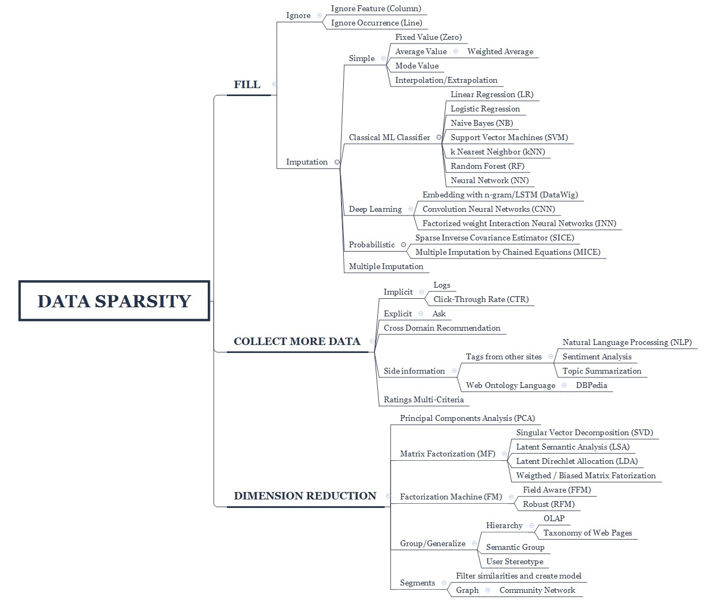
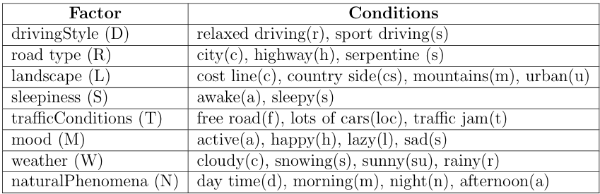
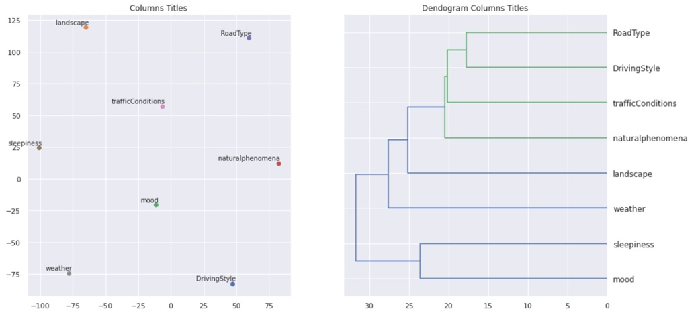
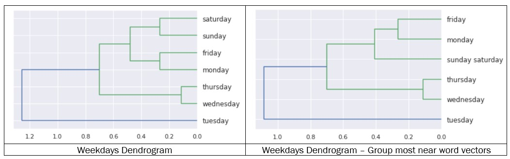
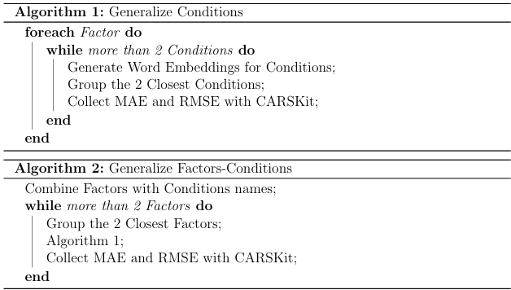
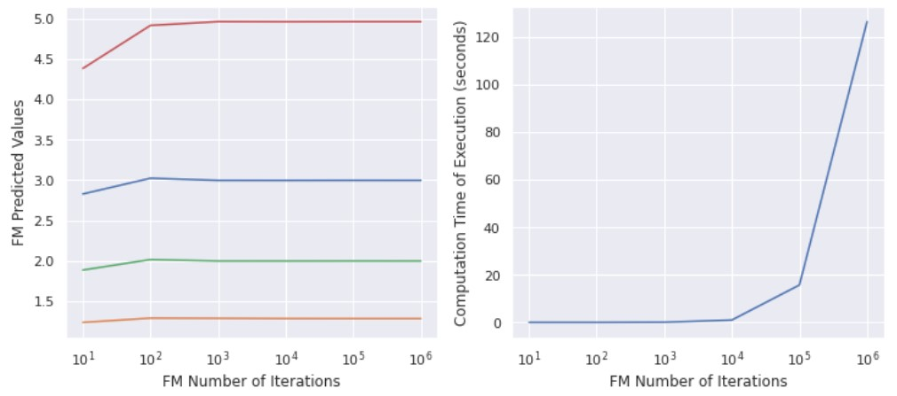
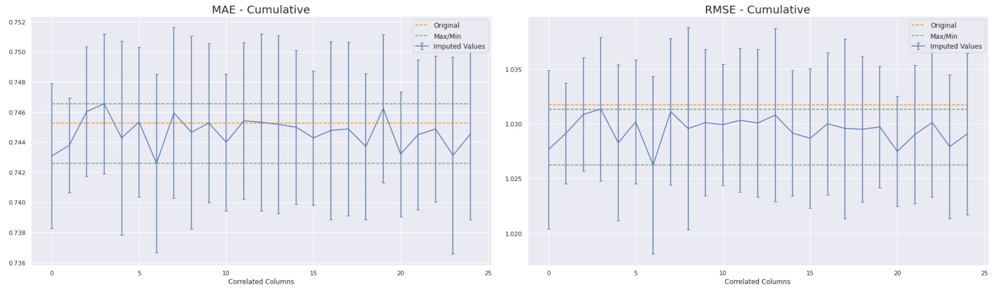
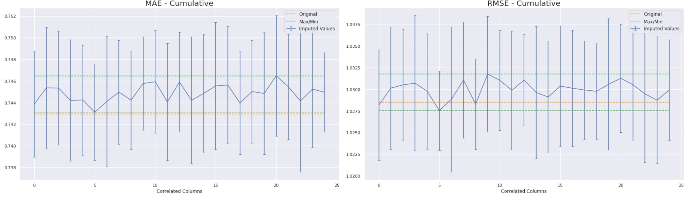
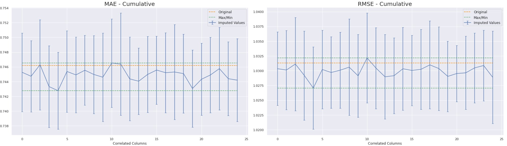

Data Sparsity treatment for  Context-Aware Recommender Systems
=============

Present the python codes for the research:

"Data Sparsity treatment for Context-Aware Recommender Systems"

Authors: Gustavo FLEURY 
Oriented by: Elsa NEGRE
Dauphine Université Paris
September 2020

All Jupyter Notebooks are tested in Google Colab environment.

[Full report here.](Data_Sparsity_treat_ContextAware_Recomm_System_REPORT.pdf)

  The proposed methods to reduce the impact of data sparsity in RS was tested using
 the InCarMusic dataset and the quality of recommendations using MAE and RMSE metrics 
 using CAMF-CU method in CARSKit.
 
  Against expectations, the cumulative imputations of correlated segments got im
 provements compared the base line, but not better compared with the individual. Using 
 cumulative imputation, we got a smaller sparsity, but not better RS results. So, 
 in the tested dataset, the application of imputation in all  possible correlation cases,
 do not improve the results.
 
  The best improvement occurs using FM imputation for an specific correlated
 columns, with an improvement of 0.54% in MAE and 0.48% in RMSE. Comparing the 
 Overall Sparsity for each group imputation with the  improvements of MAE and RMSE,
 we can verify that the less sparsity do not causes better RS results.

  The improvements of FM are 0.5%. Despite it looks not so signi cant initially,
 applying it frequently and in big environments could result in relevant result for the
 quality of RS. And need to consider the test dataset is highly sparse, so the 0.5% of
 improvements is relevant in these conditions.

  The method to segment more dense matrix depends in exist correlated contexts
 in the dataset and the level of correlation. In this study we used the InCarsMusic
 dataset and correlation coe cient bigger than 0.99. More studies are necessary to
 verify the impact of use di erent correlation coe cient threshold and the application
 in others CARS dataset.
## Data Sparsity treatment approaches

## InCarMusic - Factor and Contextual Conditions

## Word Embeddings for Context Generalization

## Algorithms

## Impact of Number of Iterations Factorial Machine

## Results
Most Frequent Rating

DataWig

Factorial Machines

